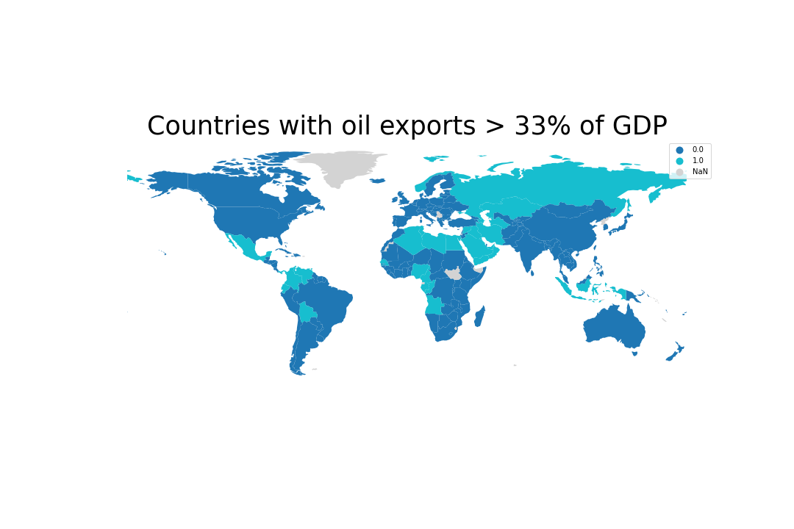

# Influence of oil on wellbeing and peace in a country

## Background and Creative Extension

The [*Muchlinski et al*](#data-sources) paper tries to predict the onset of civil wars based 
on a variety of features describing a country in a given year. In order to achieve this, 
they use a Random Forest classifier, which, according to their results, performs far better
than the previously-established Logistic Regression methods. 

For our creative extension, we chose to focus on war in general, rather than civil war.
We used the same data as *Muchlinski et al* and extended it with [other datasets](#data-sources)
containing historical information about conflicts and income inequality. Our objective was to 
examine whether the presence of oil in a country has made it more likely for it to be involved 
in a war. 

## Why the focus on oil?

During the course of past century, oil has taken a central spot in the World's economy: as we can see from the graph below, the use of oil has been steadily increasing in the past 50 years, with millions of barrels of oil consumed every day. In addition, entire economies are based on the extraction and sale of this strategic good, so much that the term "petrodollars" has been introduced to identify the billions of dollars of revenue generated by the sale of oil. Given its undeniable importance in the economy, as well as its heterogeneous distribution over the globe, oil has had an enormous influence on the political balance between countries. 

Source: [Wikimedia](https://en.wikipedia.org/wiki/List_of_countries_by_oil_consumption#/media/File:EIA_petroleum_consumption_of_selected_nations_1960-2008.png)              |  Source: [Wikimedia](https://en.wikipedia.org/wiki/Petrodollar_recycling#/media/File:Opecrev.gif)
:-------------------------:|:-------------------------:
  |  

Great oil exporters, however, have often been linked with controversies. The 2003 invasion of Iraq ([3rd exporter in 2014](https://www.cia.gov/library/publications/the-world-factbook/rankorder/2242rank.html)), for instance, officially justified with the concern over presence of weapons of mass distruction, is widely attributed to economical factors, related to the abundance of oil in the territory. More recently, the poor working conditions and dramatic economical and social inequality in Qatar ([14th oil exporter in 2014](https://www.cia.gov/library/publications/the-world-factbook/rankorder/2242rank.html)) have been prominent in the news, following its choice as the host country for the 2022 World Cup. Indeed, it is not hard to find more similar examples.

In this data story, we will therefore attempt to back this common perception up with data: we will attempt to determine whether or not oil-rich countries are in fact more vulnerable to social inequality, poor life conditions, and war.

## What to expect

In order to complete the aforementioned task, we have combined data from multiple datasets, gathering information over world countries in a timespan going from 1961 to 1999: this choice springs from the fact that this period represents a conosistent intersection between timespans of multiple dataset. 

In the first section, we will use data provided by ... database to find out whether or not oil is correlated to social issues in a country. In particular, we will take into account factors such as illiteracy, life expectancy, and [Gini coefficient](https://en.wikipedia.org/wiki/Gini_coefficient). In case a correlation is found, we will then dive deeper, and wonder whether oil can be cause of these issues.

In the second section, we will take inspiration from [_Muchlinski et al_](#data-sources) , and try to build a predictor for the presence of war in a country: this will serve the purpose of identifying the most influential variables for this event, as they will be needed for the following part.

In the third and final section, we will try to investigate the role of oil in the outburst of a conflict. In particular, we will try to understand whether or not the large availability of oil in a country can influence the probability of a war outbreaking in that location.


## Section 1: The impact of oil on population well-being and social inequality

First of all, we should make a distinction between **oil-rich** and **oil-dependent** countries. We consider a country to be oil-rich if it simply has a lot of oil on its territory. Oil-dependent countries, however, are those in which a large portion of GDP (> 33%) depends on the sale of oil. Canada, for example, being among the [top-5 oil exporters](https://en.wikipedia.org/wiki/List_of_countries_by_oil_exports) in the world, is oil-rich, but not oil-dependent. Saudi Arabia is both.

---


With oil being a possible contributor to the so-called "[Resource Curse](https://en.wikipedia.org/wiki/Resource_curse)", it can bring great wealth to a country's people, but also conflicts and instability. Let's look at which countries were at war between 1961 and 2000. 


_Countries at war (light blue) between 1961 and 2000 (missing data in white)_

To get a qualitative sense of whether wars in in the latter half of the previous century were mostly fought in oil-dependent countries, let's compare the above animation with the image below.


_Countries whose oil exports amount to more than 33% of their GDP in at least one year (missing data in grey)._

Is there an overlap? Yes, we can clearly see (as expected) some connections in the Middle East and North Africa, along with Venezuela, Angola and so on. In fact, it is hard to find an oil-dependent country (besides Norway) that *didn't* live through a conflict since the 1960s.

Visual inspection is not enough to make conclusions, though, so let's warm up our statistical brain with a heat map (no pun intended), comparing the correlation of a few variables that affect the wealth and wellbeing of a population. Variables are defined for all given years, between 1961 and 2000.

* `life`: life expectancy
* `oil`: (categorical) whether oil exports accounted for more than 33% of GDP.
* `fuelexp`: ratio of fuel exports over GDP.
* `war`: (categorical) whether a country was at war.
* `illiteracy`: illiteracy rate
* `infant`: infant mortality
* `intensity_level`: (categorical) intensity of the war, if any.
* `cumulative_intensity`: (categorical) like `intensity_level`, but accumulated across years and capped at a maximum value.
* `gini`: gini coefficient for the country, as a measure of income inequality.


_Statistical correlation between variables relating to wealth and wellbeing of a population._

From the correlation matrix above we can immediately pick out some of the obvious correlations, like illiteracy and infant mortality with life expectancy. Oil and fuel exports, however, don't seem to correlate much with anything, except for each other (obviously) and the gini coefficient. 

The correlation with the Gini coefficient is positive, suggesting that oil and fuel overall lead to a slightly higher inequality in the distribution of resources. This is coherent with the common perception, according to which the oil resources are controlled by few powerful individuals.

The heatmap below shows some key indicators of wellbeing in relation to fuel exports in oil-dependent countries. This reiterates the point above that oil/fuel exports don't necessarily impact a population's wellbeing negatively, in fact the opposite is likely to be true, depending on the circumstances. 

Given the many complex factors that come into play during conflicts, however, we cannot really jump to conclusions by looking at some raw correlations. Abundance of oil per se is very likely not enough to determine the well-being of a country; however, we can logically think that it might have a strong influence on nations in certain conditions. So, really, the question that we should be asking is: **given equal preconditions, does having oil make a country more likely to be involved in a war?** 


_Heatmap of normalized life expectancy, infant mortality, illiteracy and fuel exports over time for oil-dependent countries. Missing data in white_

## Section 2: Let's look away from oil for a bit - predicting wars

The question we asked above requires a couple clarifications: 
1. How do we define **being involved in a war**?
1. What **preconditions** do we use to compare countries?

For number 1, we define a country as *being involved in a war* when a war is ongoing *on its territory* in a given year. This will allow us to determine if a country either was invaded or subject to serious internal turmoils, as this is what we are interested in when measuring the (possible) negative influence of oil. 

For number 2, instead, we do the following, inspired by [*Muchlinski et al.*](#data-sources):

1. Train a Random Forest algorithm to predict whether or not a country will be involved in a war during a given year.
1. Rank dataset features by their importance, expressed as their normalized mean decrease in gini score.
1. Take the top *N* features that account for 25% of the total importance. That is, *N* is defined such that the sum of the importances of the top *N* features should be at least 0.25 (since importances are normalized and sum to 1).

We performed this analysis on most of the features that [*Muchlinski et al*](#data-sources) used in their analysis. Obviously, we removed features strictly dependent on the target one to train a model that made sense. We also removed some polynomial features (e.g. "square of primary commodity exports over GDP"), as these are not generally required in Random Forest models.

Given that historical data for countries' Gini scores is not always complete, we trained our model on a dataset with and without the `gini` feature. The table below shows our F1 scores for the two models: 

_F1 scores for both Random Forest models across multiple executions. Because of the randomness, the values may vary_

| Dataset        | F-score     | Accuracy   |
|----------------|-------------|------------|
| Without `gini` | 0.88        | 94%        |
| With `gini`    | 0.85        | 93%        |

As we can see, both scores are fairly high: as a consequence we can assume that our fit is accurate and that the features identified as most important are really meaningful. It is important to notice that a baseline predictor that always outputs 0 (no war) will yield an accuracy of 77% (without `gini`) and 78% (`gini`). The performance of the model is therefore a solid improvement over the baseline model.

<!-- like skip -->\
In the case without the `gini` feature, we can see the classification in the table below. Unfortunately, the description for `lpopns` was not available, but, according to sources found online, it represents the natural logarithm of the size of population. Interestingly enough, the very first feature, `sxpnew`, *could* be related to oil exports, though we can't conclude this without looking more into detail.

_Top features for the model without `gini`_

| Feature   |   Importance | Description                                    |
|:----------|:-------------|:-----------------------------------------------|
| sxpnew    |    0.0655414 | Primary commodity exports/GDP                  |
| lpopns    |    0.0536241 | Natural log of population size                 |
| agexp     |    0.0342671 | Agricultural raw materials/merchandise exports |
| numlang   |    0.0331492 | Number of languages in Ethnologue              |
| trade     |    0.0319749 | Trade as % of GDP                              |
| expgdp    |    0.0316218 | Goods/services export as % of GDP              |

<!-- like skip -->\
Below is the classification for the model *with* the `gini` feature. We can see a little bit of overlap with the previous model, though this time ethnic heterogeneity and illiteracy are considered to be the top predictors of war. Surprisingly, `gini` itself is not present in the table.

_Top features for the model with `gini`_

| Feature    |   Importance | Description                       |
|:-----------|:-------------|:----------------------------------|
| ehet       |    0.0551632 | Ethnic heterogeneity index        |
| illiteracy |    0.053599  | Illiteracy rate                   |
| sxpnew     |    0.0480203 | Primary commodity exports/GDP     |
| lpopns     |    0.0425471 | N/A                               |
| trade      |    0.0344304 | Trade as % of GDP                 |
| expgdp     |    0.0338172 | Goods/services export as % of GDP |

<!-- like skip -->\
Is there anything missing from these two tables? We trained our model to predict wars, so where are `fuelexp` (fuel exports as % of GDP) and `oil` (whether oil exports are more than 33% of GDP)? According to these models, they are not good predictors when it comes to war. Alright, time to pack up and analyse some other topic, right? Not exactly. In reality, this makes sense: many wars have been fought over reasons other than oil or fuel and not all exporters of these resources experienced wars.

Now that we know what the top predictors of a war are, we can use them to match countries with similar preconditions. To state our question more precisely now: **given two countries with similar predictors of war, does being oil-dependent increase the likelihood of being involved in a war?**

## Section 3: Oil and likelihood of war in a country 

In order to match countries with similar preconditions, we computed propensity scores with Logistic Regression, using one of the following as the classification variable:
* `oil` (oil exports > 33% GDP)
* `fuelexp > 33`, i.e. a derived binary variable for whether fuel exports are larger than 33% of GDP.

Once this was done, we matched country-year pairs based on the smallest difference in propensity scores. The classification variable mentioned above was used to split countries into a **treatment** and **control** group, which we used to form pairs with similar propensities but opposite classification.

_Example of matched country-year pairs_

| Country 1 | Year 1 | Country 2 | Year 2 |
|:----------|:------:|:----------|:------:|
| Algeria | 1963 | Mongolia | 1996 |
| Angola | 1991 | Singapore | 1981 |
| Cameroon | 1989 | Mozambique | 1978 |
| Ecuador | 1994 | South Vietnam | 1964 |
| Egypt | 1998 | Mauritania | 1967 |
| Gabon | 1970 | Malaysia | 1968 |
| Indonesia | 1984 | Senegal | 1978 |
| Iran | 1980 | Taiwan | 1997 |

<!-- like skip -->\
In order to assess the quality of our matches, we compared the distributions of our predictor features from the previous section, before and after matching. Here is an example:


_`illiteracy` feature before and after matching based on propensity scores_

As we can see, the distributions of treatment and control groups became more similar to each other after the matching was done. We observed similar improvements for all predictor features, on both the datasets with and without `gini`.

After matching on propensity scores, we calculated the [Average Treatment Effect](https://en.wikipedia.org/wiki/Average_treatment_effect) (ATE).

<!-- $$ATE = \frac{1}{N} \sum_i^N y_{treat}^{(i)} - y_{\neg treat}^{(i)}$$ -->


Here $y$ represents whether or not a country was at war in a given year (`war` variable). $treat$ and $\neg treat$ indicate whether the country-year pair belongs to the treatment or control group. The ATE represents the average difference in outcome for all paired elements. If the treatment (`oil`/`fuelexp > 33`) causes war, then the ATE will be closer to 1. If it doesn't it will be closer to zero.

As the original dataset considers almost all kind of conflicts as war (for example, U.S. is considered to be at war in its country for several years after 2001, because of the conflict with Al-Quaeda), we decided to perform a similar analysis on a new derived variable `intense_war`, being `1` for wars that caused more than 1000 deaths in the specific year. This aims at verifying whether the presence of oil better correlates to the presence of more serious wars. 

<!--TODO: bar plot instead of this table?-->
_ATE results after propensity score matching. Confidence intervals were calculated with bootstrap sampling_

|Dataset|Treatment|Outcome|ATE|95% Confidence|
|--|--|--|--|--|
|With `gini`|`oil`|`war`|0.185|0.116, 0.248|
|Without `gini`|`oil`|`war`|0.0938|0.0501, 0.134|
|With `gini`|`fuelexp > 33`|`war`|0.157|0.037, 0.259|
|Without `gini`|`fuelexp > 33`|`war`|0.178|0.121, 0.238|
|With `gini`|`oil`|`intense_war`|0.0728|0.0331, 0.113|
|Without `gini`|`oil`|`intense_war`|0.0733|0.0488, 0.099|
|With `gini`|`fuelexp > 33`|`intense_war`|0.0556|-0.0093, 0.12|
|Without `gini`|`fuelexp > 33`|`intense_war`|0.0822|0.0521, 0.118|

<!-- like skip -->\
All ATE scores are above zero, even if we take the confidence intervals into account. Though the values are quite low, this means that being oil-dependent (or having a large share of fuel exports) *does* slightly increase the likelihood of being involved in a war. The highest ATE scores actually occur on the `war` outcome variable, which means that, under equal preconditions, oil does not increase the likelihood of undergoing an intense war. The correlation is weak, but still statistically significant.

## Conclusion: Oil - Blessing or Curse?

In this article, we have been analysing the effects of oil on various factors that can determine the well-being of a country. While no significant result could be obtained regarding the average living conditions of the population, the data showed a correlation between the presence of oil and likelihood of suffering a war, given similar preconditions. This indeed appears reasonable. An untrained eye could treat this result as confermation of many widespread speculations, according to whom oil-rich third world countries are attacked or made unstable to secure their resources. While this is certainly possible and logical, the results we obtained do not offer any proof in this regard, as no analysis on the nature and cause of wars was performed.

Additionally, the weak correlation found between oil and Gini score falls in line with the commonly percieved inequalities in oil-dependent countries, where most of the resources are in the hands of few. Once again, this topic could not be explored further. As a consequence, no assumption on causation can be made.

Finally, the results we have obtain could not take into account conflicts that have arised in the earliest years of the 20th century, and have reinforced the common perception of oil as a catalist for invasions and external interventions aimed at mining political stability of a country. Indeed, having a rough idea of the preconditions of Iraq, we can infer that adding said conflicts would have most likely increased the ATE score measure, yielding an even stronger correlation between oil and war in the same country.


# Data Sources
1. [Muchlinski et al., _Comparing Random Forest with Logistic Regression for Predicting Class-Imbalanced Civil War Onset Data_](https://dataverse.harvard.edu/dataset.xhtml?persistentId=doi:10.7910/DVN/KRKWK8)
1. [World Inequality Database](https://wid.world/)
1. [UCDP/PRIO](https://ucdp.uu.se/)
1. [World Income Inequality Database](https://www.wider.unu.edu/data)
1. [World Factbook](https://www.cia.gov/library/publications/the-world-factbook/rankorder/2242rank.html)

<!-- ### Markdown

Markdown is a lightweight and easy-to-use syntax for styling your writing. It includes conventions for

```markdown
Syntax highlighted code block

# Header 1
## Header 2
### Header 3

- Bulleted
- List

1. Numbered
2. List

**Bold** and _Italic_ and `Code` text

[Link](url) and 
``` -->

<!-- For more details see [GitHub Flavored Markdown](https://guides.github.com/features/mastering-markdown/). -->
