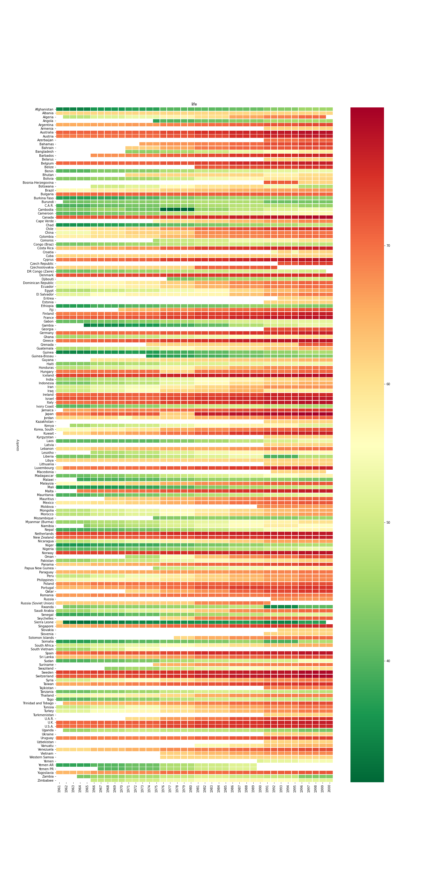
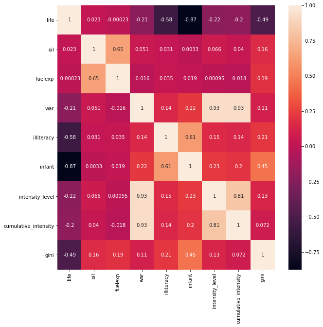

# Influence of oil on wellbeing and peace in a country

## Why the focus on oil?

During the course of past century, oil has taken a central spot in the World's economy: as we can see from the graph below, the use of oil has been steadily increasing in the past 50 years, with millions of barrels of oil consumed every day. In addition, entire economies are based on the extraction and sale of this strategic good, so much that the term "petrodollars" has been introduced to identify the billions of dollars of revenue generated by the sale of oil. Given its undeniable importance in the economy, as well as its heterogeneous distribution over the globe, oil has had an enormous influence on the political balance between countries. 

Great oil exporters, however, have often been linked with controversies. The 2003 invasion of Iraq, for instance, officially justified with the concern over presence of weapons of mass distruction, is widely attributed to economical factors, related to the abundance of oil in the territory https://www.cia.gov/library/publications/the-world-factbook/rankorder/2242rank.html. More recently, the poor working conditions and dramatic economical and social inequality in Qatar (14th oil exporter in 2014 https://www.cia.gov/library/publications/the-world-factbook/rankorder/2242rank.html) have been prominent in the news, following its choice as the host country for the 2022 World Cup. Indeed, it is not hard to find more similar examples.

In this data story, we will therefore attempt to back this common perception up with data: we will attempt to determine whether or not oil-rich countries are in fact more vulnerable to social inequality, poor life conditions, and war.

## What to expect

In order to complete the aforementioned task, we have combined data from multiple datasets, gathering information over world countries in a timespan going from 1961 to 1999: this choice springs from the fact that this period represents a conosistent intersection between timespans of multiple dataset. 

In the first section, we will use data provided by ... database to find out whether or not oil is correlated to social issues in a country. In particular, we will take into account factors such as illiteracy, life expectancy, and gini score. In case a correlation is found, we will then dive deeper, and wonder whether oil can be cause of these issues.

In the second section, we will take inspiration from _insert civil war paper_ , and try to build a predictor for the presence of war in a country: this will serve the purpose of identifying the most influential variables for this event, as they will be needed for the following part.

In the third and final section, we will try to investigate the role of oil in the outburst of a conflict. In particular, we will try to understand whether or not the large availability of oil in a country can influence the probability of a war outbreaking in that location.

https://upload.wikimedia.org/wikipedia/commons/thumb/9/9f/EIA_petroleum_consumption_of_selected_nations_1960-2005.png/800px-EIA_petroleum_consumption_of_selected_nations_1960-2005.png

https://upload.wikimedia.org/wikipedia/commons/thumb/0/0a/Opecrev.gif/1280px-Opecrev.gif

**TODO: add heatmaps**


[](img/year_heatmap_fuelexp.png) [](img/year_heatmap_fuelexp.png) [](img/year_heatmap_fuelexp.png) [](img/year_heatmap_fuelexp.png)


## Section 1: The impact of oil on population well-being and social inequality

First of all, we should make a distinction between **oil-rich** and **oil-dependent** countries. We consider a country to be oil-rich if it simply has a lot of oil on its territory. Oil-dependent countries, however, are those in which a large portion of GDP (> 33%) depends on the sale of oil. Canada, for example, being among the [top-5 oil exporters](https://en.wikipedia.org/wiki/List_of_countries_by_oil_exports) in the world, is oil-rich, but not oil-dependent. Saudi Arabia is both.

---

With oil being a possible contributor to the so-called "[Resource Curse](https://en.wikipedia.org/wiki/Resource_curse)", it can bring great wealth to a country's people, but also conflicts and instability. Let's look at which countries were at war between 1961 and 2000. 


_Countries at war (light blue) between 1961 and 2000 (missing data in white)_

To get a qualitative sense of whether wars in in the latter half of the previous century were mostly fought in oil-dependent countries, let's compare the above animation with the image below.


_Countries whose oil exports amount to more than 33% of their GDP (missing data in grey)._

Is there an overlap? Yes, we can clearly see (as expected) some connections in the Middle East and North Africa, along with Venezuela, Angola and so on. In fact, it is hard to find an oil-dependent country (besides Norway) that *didn't* live through a conflict since the 1960s.

Visual inspection is not enough to make conclusions, though, so let's warm up our statistical brain with a heat map (no pun intended), comparing the correlation of a few variables that affect the wealth and wellbeing of a population. Variables are defined for all given years, between 1961 and 2000.

* `life`: life expectancy
* `oil`: (categorical) whether oil exports accounted for more than 33% of GDP.
* `fuelexp`: ratio of fuel exports over GDP.
* `war`: (categorical) whether a country was at war.
* `illiteracy`: illiteracy rate
* `infant`: infant mortality
* `intensity_level`: (categorical) intensity of the war, if any.
* `cumulative_intensity`: (categorical) like `intensity_level`, but accumulated across years and capped at a maximum value.
* `gini`: Gini score for the country, as a measure of income inequality.


_Statistical correlation between variables relating to wealth and wellbeing of a population._

From the confusion matrix above we can immediately pick out some of the obvious correlations, like illiteracy and infant mortality with life expectancy. Oil and fuel exports, however, don't seem to correlate much with anything, except for each other (obviously) and the Gini score. 

The correlation with the Gini score is positive, suggesting that oil and fuel overall lead to a slight improvement in a population's wellbeing. In the long term, this intuitively makes sense: if we look at a time span of four decades, it's unlikely that a country was at war for most of those years and, all other things being equal, it is probably better to *have* oil than to *not* have it.

So, really, the question that we should be asking is: **given equal preconditions, does having oil make a country more likely to be involved in a war?**

Again, this requires a few clarifications: we defined a country as *being involved in a war* when it had a war *on its territory* in a given year. 


## Section 2: Let's look away from oil for a bit - predicting wars

## Section 3: Oil and likelihood of war in a country 

## Conclusion: Is oil a cause of problems for a country?

# Sources
1. [Muchlinski et al., _Comparing Random Forest with Logistic Regression for Predicting Class-Imbalanced Civil War Onset Data_](https://dataverse.harvard.edu/dataset.xhtml?persistentId=doi:10.7910/DVN/KRKWK8)
1. [World Inequality Database](https://wid.world/)
1. [UCDP/PRIO](https://ucdp.uu.se/)
1. [World Income Inequality Database](https://www.wider.unu.edu/data)

<!-- ### Markdown

Markdown is a lightweight and easy-to-use syntax for styling your writing. It includes conventions for

```markdown
Syntax highlighted code block

# Header 1
## Header 2
### Header 3

- Bulleted
- List

1. Numbered
2. List

**Bold** and _Italic_ and `Code` text

[Link](url) and 
``` -->

<!-- For more details see [GitHub Flavored Markdown](https://guides.github.com/features/mastering-markdown/). -->
